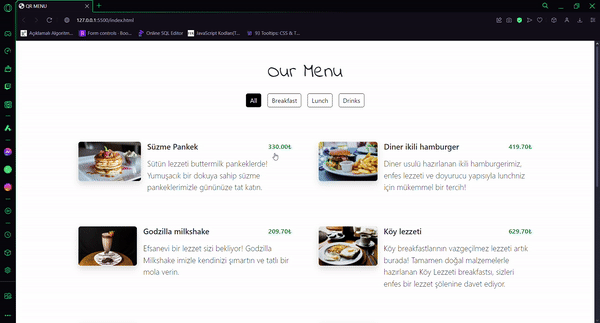

# QR-Menu📄🎂

This project is a menu page built using JavaScript, HTML, and CSS. It features a fully responsive design that adapts to different screen sizes, providing an intuitive navigation experience with a user-friendly interface.

# Features🍕🍟

- **Responsive Design:** Optimized for various devices (mobile, tablet, desktop).
- **Dynamic Menu with JavaScript:** Interactive menu functionality powered by JavaScript.
- **User-Friendly Interface:** Simple and clean menu structure for easy navigation.

# Preview🧁🥘

